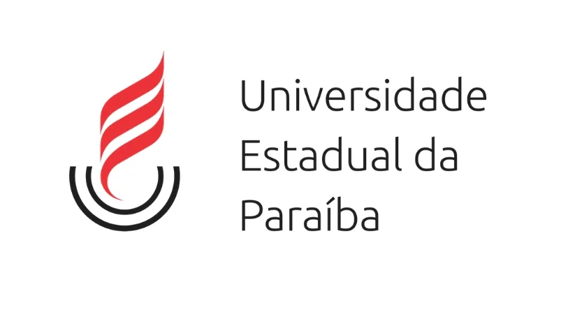

# Universidade Estadual da Paraíba

Bem-vindo ao repositório de projetos da UEPBB! Este é o lugar onde guardamos e compartilhamos todos os projetos acadêmicos e trabalhos desenvolvidos durante nossa jornada na faculdade. Aqui, você encontrará uma vasta coleção de projetos inovadores, pesquisas criativas e soluções tecnológicas desenvolvidas por nossa talentosa comunidade acadêmica.

Este repositório serve como um arquivo vivo de nossa jornada acadêmica, permitindo que alunos atuais e futuros, professores e entusiastas do conhecimento explorem e se inspirem com o que nossa comunidade acadêmica produziu. Sinta-se à vontade para colaborar, clonar, bifurcar ou contribuir para os projetos aqui presentes. Juntos, continuaremos a promover a excelência acadêmica e a inovação em nossa instituição de ensino.

### Cadeiras de ensino

O curso ainda está em desenvolvimento, mas essas são as cadeiras onde foram realizados projetos e atividades:

  - Grafos
  - Linguagem de Programação I
  - Linguagem de Programação II
  - Estrutura de Dados